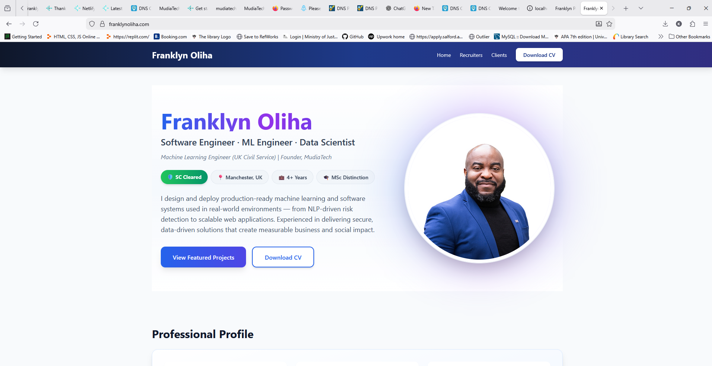
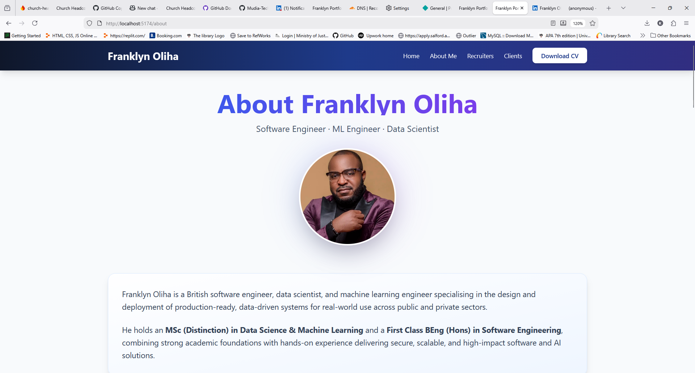
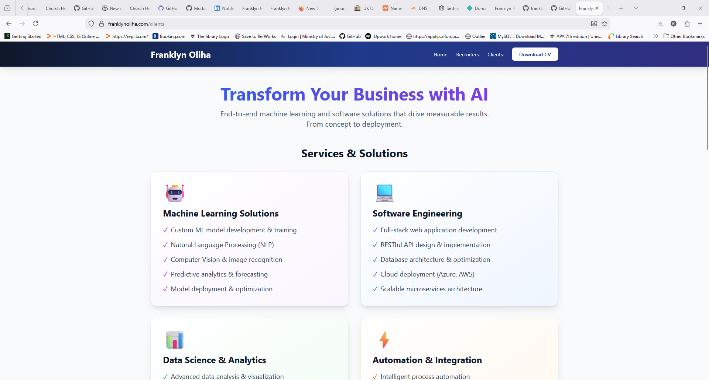
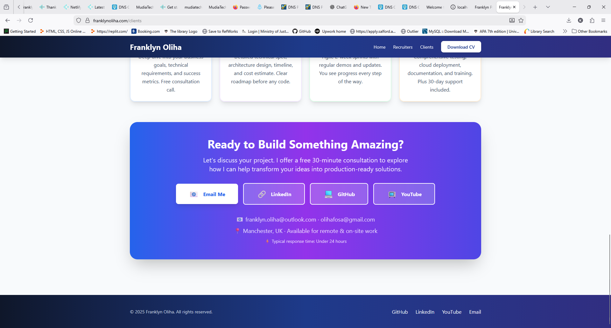

# Franklyn Oliha - Professional Portfolio

[](https://app.netlify.com/projects/franklynoliha-portfolio/deploys)


A modern, responsive portfolio website showcasing professional experience, technical expertise, and projects in Machine Learning Engineering, Software Development, and Data Science.

## 🔗 Live Demo

🌍 **Production Website:**  
https://www.franklynoliha.com

Hosted on Netlify with HTTPS, global CDN, and continuous deployment from GitHub.

## 📸 Screenshots

### Home Page


_Professional hero section with profile image and key highlights_

### About Me Page


_Detailed professional background and career journey_

### Recruiters Page


_Professional summary, CV download and comprehensive technical skills_

### Clients Page


_Service offerings and project approach_

### Footer View


_Footer with contact information and social links_

## 🌟 Features

- **Modern Design**: Clean, professional UI with gradient effects and smooth animations
- **Responsive Layout**: Fully optimized for desktop, tablet, and mobile devices
- **Three Main Sections**:
  - **Home**: Professional profile, skills showcase, and featured projects
  - **For Recruiters**: Comprehensive professional experience, technical expertise, and CV download
  - **For Clients**: Service offerings, project approach, and contact information
- **Dark Navigation**: Elegant gradient navbar and footer for enhanced aesthetics
- **Interactive Components**: Hover effects, smooth transitions, and engaging animations
- **SEO Optimized**: Proper meta tags and semantic HTML structure

## 🚀 Technologies Used

### Frontend

- **React 18** - Modern UI library
- **Vite** - Next-generation frontend build tool
- **React Router DOM** - Client-side routing
- **Tailwind CSS** - Utility-first CSS framework

### Development Tools

- **PostCSS** - CSS processing
- **Autoprefixer** - Automatic vendor prefixing
- **ESLint** - Code quality and consistency

## 📋 Prerequisites

Before you begin, ensure you have the following installed:

- **Node.js** (v16 or higher)
- **npm** (v7 or higher)

## 🛠️ Installation & Setup

1. **Clone the repository**

   ```bash
   git clone https://github.com/Franklyn-SWE/franklyn-portfolio.git
   cd franklyn-portfolio
   ```

2. **Install dependencies**

   ```bash
   npm install
   ```

3. **Add your profile image**

   - Place your professional photo as `profile.jpg` in the `public/` folder
   - Recommended size: 500x500px or larger (square format)

4. **Add your CV**

   - Place your CV PDF as `cv.pdf` in the `public/` folder

5. **Start development server**

   ```bash
   npm run dev
   ```

   The site will be available at `http://localhost:5173`

## 🏗️ Build for Production

```bash
# Create optimized production build
npm run build

# Preview production build locally
npm run preview
```

The production-ready files will be in the `dist/` folder.

## 📁 Project Structure

```
franklyn-portfolio/
├── public/
│   ├── profile.jpg          # Your professional photo
│   └── cv.pdf               # Your CV/resume
├── src/
│   ├── components/
│   │   ├── About.jsx        # About/Professional Profile section
│   │   ├── Footer.jsx       # Site footer with links
│   │   ├── Hero.jsx         # Hero section with photo
│   │   ├── Navbar.jsx       # Navigation bar
│   │   ├── Projects.jsx     # Featured projects showcase
│   │   └── Skills.jsx       # Technical skills grid
│   ├── pages/
│   │   ├── Home.jsx         # Homepage
│   │   ├── Recruiters.jsx   # Page for recruiters
│   │   └── Clients.jsx      # Page for potential clients
│   ├── App.jsx              # Main app component with routing
│   ├── main.jsx             # Application entry point
│   └── index.css            # Global styles and animations
├── index.html               # HTML template
├── package.json             # Dependencies and scripts
├── tailwind.config.js       # Tailwind CSS configuration
├── postcss.config.js        # PostCSS configuration
├── vite.config.js           # Vite configuration
└── README.md                # This file
```

## 🎨 Customization Guide

### Update Personal Information

1. **Hero Section** (`src/components/Hero.jsx`)

   - Update your name
   - Modify job titles
   - Change location and badges
   - Update bio text

2. **About Section** (`src/components/About.jsx`)

   - Edit professional summary
   - Update statistics (years, projects, etc.)

3. **Skills** (`src/components/Skills.jsx`)

   - Add/remove programming languages
   - Update frameworks and tools
   - Customize skill categories

4. **Projects** (`src/components/Projects.jsx`)

   - Replace with your own projects
   - Update descriptions and metrics
   - Change tech stack badges

5. **Professional Experience** (`src/pages/Recruiters.jsx`)
   - Add your work history
   - Update job titles and companies
   - Modify achievements and responsibilities

### Color Scheme

The primary color scheme uses blue, purple, and indigo gradients. To customize:

**Tailwind Config** (`tailwind.config.js`):

```javascript
theme: {
  extend: {
    colors: {
      accent: "#2563eb", // Change primary accent color
    },
  },
}
```

**Update gradient colors** in components by modifying Tailwind classes:

- `from-blue-600` → `from-yourcolor-600`
- `to-purple-600` → `to-yourcolor-600`

### Contact Information

Update email and social links in:

- `src/components/Footer.jsx` - Footer links
- `src/pages/Recruiters.jsx` - Recruiter contact section
- `src/pages/Clients.jsx` - Client contact section

## 🌐 Deployment

### Production (Netlify – Live)

This portfolio is deployed using **Netlify** with continuous deployment from GitHub.

- **Live URL:** https://www.franklynoliha.com
- **Hosting:** Netlify
- **CI/CD:** Automatic deploys on every push to the `master` branch
- **Security:** HTTPS via Let’s Encrypt
- **Performance:** Global CDN

### Local Development

````bash
npm run dev

## 📱 Browser Support

| Browser | Version |
|---------|---------||
| 🌐 Chrome | Latest |
| 🦊 Firefox | Latest |
| 🧭 Safari | Latest |
| 💠 Edge | Latest |
| 📱 Mobile | iOS Safari, Chrome Mobile |

## ⚡ Performance Metrics

| Metric | Score |
|--------|-------|
| 🏆 Lighthouse Score | 95+ |
| ⚡ First Contentful Paint | < 1.5s |
| 🎯 Time to Interactive | < 3s |
| 🖼️ Image Optimization | Lazy loading enabled |
| 📦 Bundle Size | Minimal & optimized |

## 🎯 Who This Portfolio Is For

| Audience | What You'll Find |
|----------|------------------|
| 💼 **Recruiters** | Comprehensive CV, technical expertise, and work experience |
| 🎯 **Hiring Managers** | Real-world projects, architecture decisions, and impact metrics |
| 🤝 **Clients** | Service offerings, project approach, and consultation info |
| 👨‍💻 **Developers** | Modern React + Vite + Tailwind implementation |

## 🤝 Contributing

This is a personal portfolio project, but suggestions and improvements are welcome!

1. **Fork** the repository
2. **Create** your feature branch
   ```bash
   git checkout -b feature/AmazingFeature
````

3. **Commit** your changes
   ```bash
   git commit -m 'Add some AmazingFeature'
   ```
4. **Push** to the branch
   ```bash
   git push origin feature/AmazingFeature
   ```
5. **Open** a Pull Request

## 📝 License

This project is open source and available under the [MIT License](LICENSE).

## 📧 Contact

<div align="center">

### **Franklyn Oliha**

[](https://www.franklynoliha.com)
[](https://www.linkedin.com/in/franklyn-oliha)
[](https://www.youtube.com/@mudiatech)
[](mailto:franklyn.oliha@outlook.com)
[](https://github.com/Franklyn-SWE)

</div>

## 🙏 Acknowledgments

- [React Team](https://react.dev/) - Amazing JavaScript framework
- [Tailwind Labs](https://tailwindcss.com/) - Utility-first CSS framework
- [Vite Team](https://vitejs.dev/) - Lightning-fast build tool
- All open-source contributors who make projects like this possible

---

<div align="center">

**Built with ❤️ by [Franklyn Oliha](https://www.franklynoliha.com)**

⭐ Star this repo if you find it useful!

</div>
