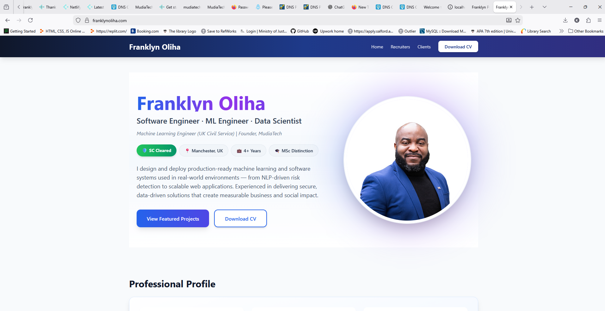
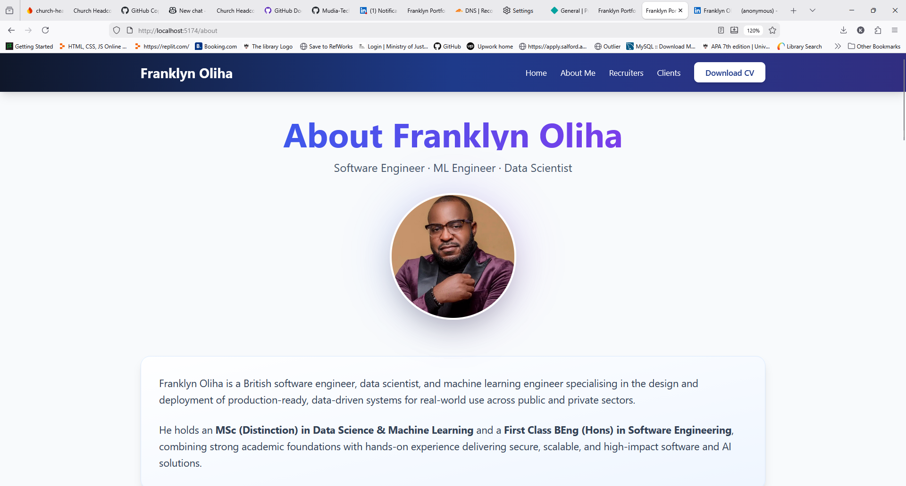
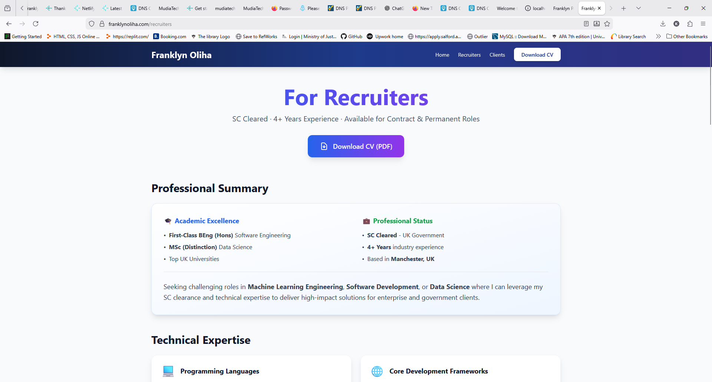
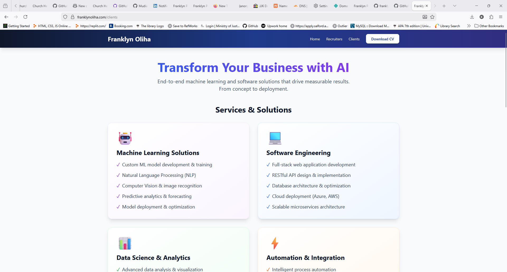
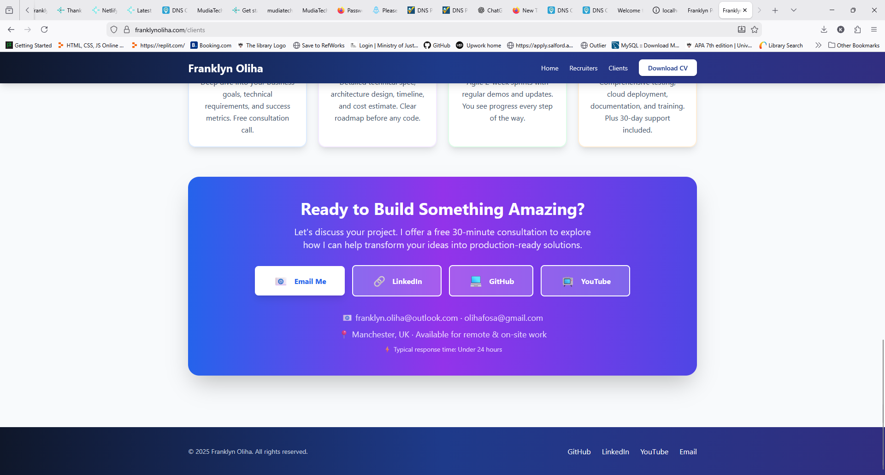

# Franklyn Oliha — Professional Portfolio

[](https://app.netlify.com/projects/franklynoliha-portfolio/deploys)


A modern, fully responsive professional portfolio for a **Machine Learning Engineer & AI Systems Builder**. Built with React 18 + Vite + Tailwind CSS and deployed on Netlify with continuous deployment from GitHub.

---

## 🔗 Live Site

🌍 **https://www.franklynoliha.com**

Hosted on Netlify with HTTPS, global CDN, and automatic deploys on every push to `master`.

---

## 📸 Screenshots

| Page     | Preview                                           |
| -------- | ------------------------------------------------- |
| Home     |                 |
| About Me |     |
| Projects |             |
| Clients  |  |
| Footer   |               |

---

## ✨ Features

- **Fully Responsive** — mobile-first design tested across phones, tablets, and desktops
- **Four Main Pages** — Home, About Me, Projects (Recruiters), Clients
- **Hero Section** — animated gradient heading, professional profile photo, badge row, dual CTA
- **Hackathon Section** — scroll-reveal animation with `IntersectionObserver`, staggered image transitions, and `prefers-reduced-motion` support
- **Featured Work Showcase** — 5 project cards on the homepage, linking to full case studies
- **Full Project Case Studies** — expandable `<details>` with problem / solution / technical approach / outcome per project
- **Technical Expertise Grid** — categorised skill tags across Languages, Frameworks, ML/AI, Deployment, and Databases
- **About Me Page** — first-person professional biography with career timeline and values
- **Clients Page** — service offerings, engagement process, and consultation CTA
- **CV Download** — single PDF downloadable from Navbar, Hero, About, and Projects pages
- **Sticky Gradient Navbar** — horizontal scroll on mobile with hidden scrollbar
- **Smooth Scroll Animations** — `cubic-bezier` transitions with reduced-motion fallback
- **Accessible** — semantic HTML, `alt` attributes on all images, `rel="noopener noreferrer"` on external links

---

## 🚀 Tech Stack

| Layer          | Technology                                      |
| -------------- | ----------------------------------------------- |
| UI Framework   | React 18                                        |
| Build Tool     | Vite 5                                          |
| Styling        | Tailwind CSS 3                                  |
| Routing        | React Router DOM v6                             |
| Animation      | Native `IntersectionObserver` + CSS transitions |
| Deployment     | Netlify (CI/CD from GitHub)                     |
| CSS Processing | PostCSS + Autoprefixer                          |

---

## 📁 Project Structure

```
franklyn-portfolio/
├── public/
│   ├── profile.jpg                    # Hero section photo
│   ├── photo.jpg                      # About page photo
│   ├── hk_1.jpeg                      # Hackathon poster image
│   ├── hk_3.jpeg                      # Hackathon group photo
│   ├── Franklyn_Oliha_Public_CV.pdf   # CV download (all links)
│   └── _redirects                     # Netlify SPA routing config
├── src/
│   ├── components/
│   │   ├── Navbar.jsx                 # Sticky gradient navbar, CV download
│   │   ├── Hero.jsx                   # Hero section, profile photo, badges, CTA
│   │   ├── Projects.jsx               # Hackathon section + featured work (Home)
│   │   ├── Skills.jsx                 # Technical expertise grid
│   │   └── Footer.jsx                 # Footer with correct social links
│   ├── pages/
│   │   ├── Home.jsx                   # Entry page (Hero + Projects)
│   │   ├── About.jsx                  # Professional biography
│   │   ├── Recruiters.jsx             # Full project case studies + skills
│   │   └── Clients.jsx                # Services & consultation
│   ├── App.jsx                        # Router and layout shell
│   ├── main.jsx                       # App entry point
│   └── index.css                      # Global styles, scrollbar-hide utility
├── screenshots/                       # Portfolio screenshots
├── index.html                         # HTML template
├── package.json                       # Scripts and dependencies
├── tailwind.config.js                 # Tailwind configuration
├── postcss.config.js                  # PostCSS configuration
├── vite.config.js                     # Vite configuration
└── README.md                          # This file
```

---

## 🛠️ Local Development

**Prerequisites:** Node.js v18+ and npm v9+

```bash
# 1. Clone
git clone https://github.com/Franklyn-SWE/franklyn-portfolio.git
cd franklyn-portfolio

# 2. Install dependencies
npm install

# 3. Start dev server
npm run dev
# → http://localhost:5173
```

### Build for Production

```bash
npm run build    # outputs to dist/
npm run preview  # preview production build locally
```

---

## 🗂️ Key Pages

### Home (`/`)

Hero section with name, title, badge row (Secure Environment Experience, Manchester UK, MSc Distinction, UK Public Sector), description paragraph, and dual CTAs. Followed by the hackathon scroll-reveal section and featured work cards.

### About Me (`/about`)

First-person professional biography covering academic background, professional experience, entrepreneurship (MudiaTech, Mudia Estate Limited), leadership values, and a Let's Connect CTA.

### Projects (`/recruiters`)

Detailed project case studies with expandable sections:

- LeadMate AI — multi-tenant SaaS platform
- Human Trafficking Coercion Detection System — BERT NLP
- UK House Price Prediction Platform — LightGBM/XGBoost
- Enterprise Automation Platform — Django + n8n + Azure
- Real-Time Attendance Management System — Firebase

### Clients (`/clients`)

ML solutions, software engineering, data science & analytics, and AI automation service offerings with consultation CTA.

---

## 🎨 Design System

| Token             | Value                                                           |
| ----------------- | --------------------------------------------------------------- |
| Primary gradient  | `from-blue-600 via-purple-600 to-indigo-600`                    |
| Navbar background | `from-slate-900 via-blue-900 to-indigo-900`                     |
| Card background   | `bg-white` with `rounded-2xl shadow-lg border border-slate-100` |
| Section spacing   | `mb-16`                                                         |
| Card padding      | `p-6 md:p-8`                                                    |
| Heading (page)    | `text-4xl md:text-5xl lg:text-6xl font-bold`                    |
| Heading (section) | `text-2xl md:text-3xl font-bold`                                |
| Body text         | `text-base md:text-lg text-slate-700 leading-relaxed`           |

---

## 🚢 Deployment

The site deploys automatically to Netlify on every push to `master`. The `public/_redirects` file enables client-side routing (React Router) to work correctly:

```
/* /index.html 200
```

---

## 📄 Changelog

### v2.0.0 — April 2026

- Added hackathon experience section with scroll-reveal animation and real images
- Full About Me page redesign — first-person copy, consistent card layout, responsive padding
- Hero badge updates: Secure Environment Experience, UK Public Sector
- Updated CV to `Franklyn_Oliha_Public_CV.pdf` across all four download points
- Fixed `scrollbar-hide` CSS utility for mobile navbar
- Fixed hero subtitle overflow on small phones (< 380px)
- Fixed Footer: correct GitHub and LinkedIn URLs, updated copyright to 2026
- Added staggered `IntersectionObserver` animation with `prefers-reduced-motion` support

### v1.0.0 — 2025

- Initial portfolio launch with Home, About, Projects, and Clients pages

---

## 📬 Contact

| Channel  | Link                                       |
| -------- | ------------------------------------------ |
| Website  | https://www.franklynoliha.com              |
| LinkedIn | https://www.linkedin.com/in/franklyn-oliha |
| GitHub   | https://github.com/Franklyn-SWE            |
| Email    | franklyn.oliha@outlook.com                 |

---

_Built with React + Vite + Tailwind CSS. Deployed on Netlify._
